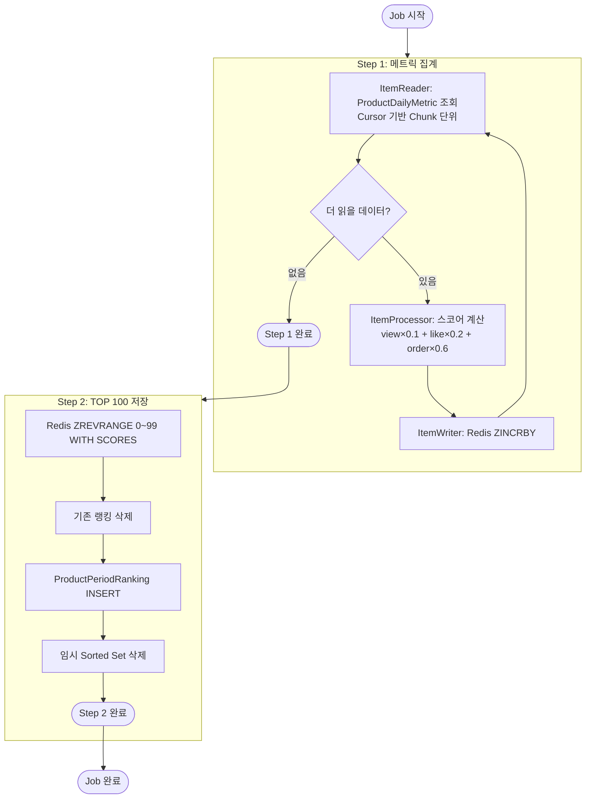
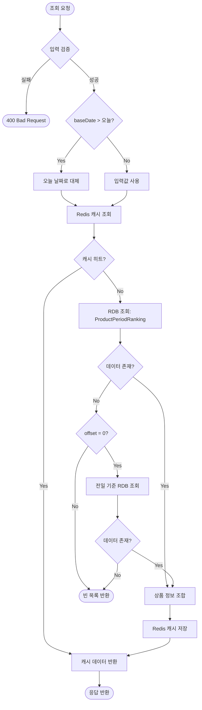
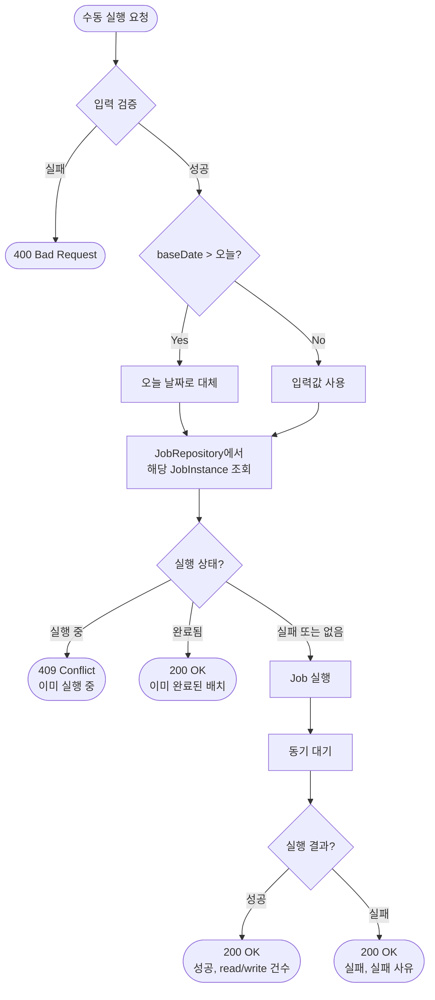

# 주간/월간 랭킹 시스템 상세 설계 및 구현 계획 문서

## 1. 시스템 플로우차트

### 1.1 주간/월간 랭킹 배치 플로우

Spring Batch의 2-Step 구조로 구현한다. Step 1에서 ProductDailyMetric을 페이징 조회하여 Redis Sorted Set에 스코어를 누적하고, Step 2에서 TOP 100을 추출하여 RDB에 저장한다. WeeklyRankingJob과 MonthlyRankingJob은 윈도우 크기(7일/30일)만 다르고 동일한 구조이다.



**배치 처리 설정:**

| 설정 | 값 | 근거 |
|------|-----|------|
| 페이지 크기 | 1000 | 메모리 부담 없이 적절한 처리량 |
| 청크 크기 | 1000 | 페이지 크기와 동일 |
| 스레드 수 | 4 | I/O 바운드, DB 커넥션 풀 고려 |
| 페이징 방식 | OFFSET | 성능 이슈 시 커서 기반으로 전환 |
| 재시도 제한 | 1회 | Chunk 단위 재시도, 장애 빠른 감지 |
| Skip 제한 | 10건 | 제한된 오류 허용, 과도한 오류 시 Job 실패 처리 |

### 1.2 주간/월간 랭킹 조회 플로우 (Cache-Aside + Fallback)



### 1.3 배치 수동 실행 API 플로우



### 1.4 기존 배치 이관

기존 commerce-streamer의 스케줄러 기반 배치 로직(HourlyRankingJob, DailyRankingJob)은 commerce-batch 모듈의 Spring Batch Job으로 이관한다. 이관 후 commerce-streamer는 Kafka 이벤트 수신 및 메트릭 적재만 담당한다.

---

## 2. 데이터 모델 설계

### 2.1 테이블 스키마

#### mv_product_rank_weekly 테이블

```sql
CREATE TABLE mv_product_rank_weekly (
    id BIGINT AUTO_INCREMENT PRIMARY KEY,
    base_date DATE NOT NULL,
    rank INT NOT NULL,
    product_id BIGINT NOT NULL,
    score DECIMAL(15,2) NOT NULL,
    created_at TIMESTAMP NOT NULL DEFAULT NOW(),
    updated_at TIMESTAMP NOT NULL DEFAULT NOW(),
    
    CONSTRAINT uk_weekly_rank UNIQUE (base_date, rank)
);
```

#### mv_product_rank_monthly 테이블

```sql
CREATE TABLE mv_product_rank_monthly (
    id BIGINT AUTO_INCREMENT PRIMARY KEY,
    base_date DATE NOT NULL,
    rank INT NOT NULL,
    product_id BIGINT NOT NULL,
    score DECIMAL(15,2) NOT NULL,
    created_at TIMESTAMP NOT NULL DEFAULT NOW(),
    updated_at TIMESTAMP NOT NULL DEFAULT NOW(),
    
    CONSTRAINT uk_monthly_rank UNIQUE (base_date, rank)
);
```

**컬럼 설명:**

- `id`: PK (Base Entity)
- `base_date`: 집계 기준일
- `rank`: 순위 (1~100)
- `product_id`: 상품 ID
- `score`: 인기도 점수
- `created_at`: 생성 시각 (Base Entity)
- `updated_at`: 수정 시각 (Base Entity)

### 2.2 Repository 구현 상세

domain-modeling에서 정의된 Repository/Port 인터페이스의 구현 상세이다.

#### ProductRankingReader (주간/월간용 RDB 구현체)

| 메서드 | 구현 방식 | 성능 특성 |
|--------|----------|----------|
| findTopRankings(query) | SELECT ... WHERE base_date = ? ORDER BY rank | O(log N), UK 활용 |
| findRankByProductId(query, productId) | SELECT rank WHERE base_date = ? AND product_id = ? | O(N), 100건 이내 |
| exists(query) | SELECT 1 WHERE base_date = ? LIMIT 1 | O(log N), UK 활용 |

**findTopRankings 구현 (JPA):**

```kotlin
@Query("SELECT r FROM MvProductRankWeekly r WHERE r.baseDate = :baseDate ORDER BY r.rank")
fun findByBaseDate(baseDate: LocalDate, pageable: Pageable): List<MvProductRankWeekly>
```

**exists 구현 (JPA):**

```kotlin
@Query("SELECT CASE WHEN COUNT(r) > 0 THEN true ELSE false END FROM MvProductRankWeekly r WHERE r.baseDate = :baseDate")
fun existsByBaseDate(baseDate: LocalDate): Boolean
```

#### 배치용 Repository (commerce-batch, JdbcTemplate)

| 메서드 | 구현 방식 | 성능 특성 |
|--------|----------|----------|
| deleteByBaseDate(baseDate) | DELETE WHERE base_date = ? | O(100), UK 활용 |
| saveAll(rankings) | Batch INSERT | O(100), 단일 트랜잭션 |

**deleteByBaseDate 구현:**

```sql
DELETE FROM mv_product_rank_weekly WHERE base_date = ?
```

**saveAll 구현 (Batch INSERT):**

```sql
INSERT INTO mv_product_rank_weekly (base_date, rank, product_id, score, created_at, updated_at)
VALUES (?, ?, ?, ?, NOW(), NOW())
```

#### 배치 Reader 쿼리 (JdbcPagingItemReader)

```sql
SELECT product_id, view_count, like_count, order_amount
FROM product_daily_metric
WHERE stat_date BETWEEN :startDate AND :endDate
ORDER BY stat_date, product_id
LIMIT :pageSize OFFSET :offset
```

**쿼리 조건 예시:**

| Period | baseDate | startDate | endDate | 범위 |
|--------|----------|-----------|---------|------|
| WEEKLY | 2025-01-02 | 2024-12-26 | 2025-01-01 | 7일 |
| MONTHLY | 2025-01-02 | 2024-12-03 | 2025-01-01 | 30일 |

### 2.3 인덱스 전략

UK `(base_date, rank)`가 주요 쿼리 패턴을 모두 커버한다. 추가 인덱스 불필요.

| 쿼리 패턴 | 인덱스 활용 |
|----------|------------|
| 랭킹 조회 (WHERE base_date = ? ORDER BY rank) | UK 활용 |
| 존재 여부 확인 (WHERE base_date = ? LIMIT 1) | UK 활용 |
| 배치 삭제 (DELETE WHERE base_date = ?) | UK 활용 |

### 2.4 Redis 키 설계

기존 컨벤션을 따라 주간/월간 키를 설계한다.

| 항목 | 키 패턴 | 예시 |
|------|--------|------|
| 주간 랭킹 캐시 | `ranking:products:weekly:{yyyyMMdd}` | `ranking:products:weekly:20250102` |
| 월간 랭킹 캐시 | `ranking:products:monthly:{yyyyMMdd}` | `ranking:products:monthly:20250102` |
| 주간 임시 집계 | `ranking:products:weekly:{yyyyMMdd}:staging` | `ranking:products:weekly:20250102:staging` |
| 월간 임시 집계 | `ranking:products:monthly:{yyyyMMdd}:staging` | `ranking:products:monthly:20250102:staging` |

**TTL 설정:**

| 키 유형 | TTL | 근거 |
|--------|-----|------|
| 주간/월간 캐시 | 1시간 | 배치 하루 1회, 캐시 미스 시 RDB fallback |
| 임시 집계 | 24시간 | 배치 완료 후 삭제, 실패 시 자동 만료 |

**RankingKeyGenerator 확장:**

```kotlin
companion object {
    // 기존
    private const val HOURLY_PREFIX = "ranking:products:hourly"
    private const val DAILY_PREFIX = "ranking:products:daily"
    // 신규
    private const val WEEKLY_PREFIX = "ranking:products:weekly"
    private const val MONTHLY_PREFIX = "ranking:products:monthly"
}
```

---

## 3. 운영 계획

### 3.1 로깅 전략

Spring Batch의 `JobExecutionListener`와 `StepExecutionListener`를 활용하여 US-4 인수 조건을 충족한다.

| 시점 | 레벨 | 로그 메시지 | 포함 정보 |
|------|------|------------|----------|
| Job 시작 | INFO | `Ranking batch job started` | jobName, baseDate, 시작 시간 |
| Job 완료 | INFO | `Ranking batch job completed` | jobName, baseDate, 종료 시간, 총 소요 시간 |
| Step 완료 | INFO | `Step completed` | stepName, readCount, writeCount, 소요 시간 |
| Job 실패 | ERROR | `Ranking batch job failed` | jobName, baseDate, 실패 사유, 실패 Step |
| Chunk 재시도 | WARN | `Chunk retry attempted` | stepName, 재시도 횟수, 예외 메시지 |

**로그 예시:**

```
INFO  [WeeklyRankingJob] Ranking batch job started - baseDate=2025-01-02, startTime=2025-01-02T03:00:00
INFO  [WeeklyRankingJob] Step completed - step=metricAggregationStep, readCount=15000, writeCount=15000, duration=12s
INFO  [WeeklyRankingJob] Step completed - step=rankingSaveStep, readCount=100, writeCount=100, duration=1s
INFO  [WeeklyRankingJob] Ranking batch job completed - baseDate=2025-01-02, endTime=2025-01-02T03:00:13, duration=13s
```

```
ERROR [WeeklyRankingJob] Ranking batch job failed - baseDate=2025-01-02, failedStep=metricAggregationStep, reason=Redis connection timeout
```

### 3.2 주요 실패 시나리오 및 대응 계획

| 실패 시나리오 | 대응 방안 | 복구 방법 |
|--------------|----------|----------|
| Step 1: Redis ZINCRBY 실패 | Chunk 재시도 1회 후 Job FAILED | 수동 재실행 (재시작 시 이어서 처리) |
| Step 1: DB 조회 실패 | Chunk 재시도 1회 후 Job FAILED | DB 상태 확인 후 수동 재실행 |
| Step 2: Redis ZREVRANGE 실패 | Job FAILED | Redis 상태 확인 후 수동 재실행 |
| Step 2: DB 저장 실패 | 트랜잭션 롤백, Job FAILED | DB 상태 확인 후 수동 재실행 |
| Step 2: 임시 키 삭제 실패 | 무시, Job 성공 | TTL 24시간 자동 만료 |
| 조회 API: 캐시 조회 실패 | RDB fallback | 자동 복구 |
| 조회 API: RDB 조회 실패 | 500 에러 | DB 상태 확인 |

---

## 4. 설계 결정 공유

### 4.1 주요 설계 결정 및 근거

| 설계 결정 | 근거 |
|----------|------|
| Redis Sorted Set을 중간 집계 저장소로 활용 | ZINCRBY 원자적 증분으로 멀티스레드 안전, 자동 정렬로 TOP 100 추출 용이 |
| 테이블 분리 (mv_product_rank_weekly, monthly) | 쿼리 단순화, 인덱스 최적화, 테이블별 독립 관리 |
| OFFSET 기반 페이징 | 구현 단순, 하루 1회 새벽 배치라 다소 느려도 허용, 문제 시 커서 기반으로 전환 |
| 임시 Sorted Set 삭제 실패 시 무시 | RDB 저장이 핵심 목표, TTL 24시간으로 자동 만료 |
| Fallback은 offset=0일 때만 | 페이지네이션 중간에서 다른 기준일 데이터 섞이면 혼란 |
| 이미 완료된 배치 재요청 시 200 OK | Spring Batch 기본 동작, 에러가 아닌 정상 상태 |
| 멀티스레드 4개 | I/O 바운드지만 DB 커넥션 풀 점유 고려, 새벽 배치라 안정성 우선 |
