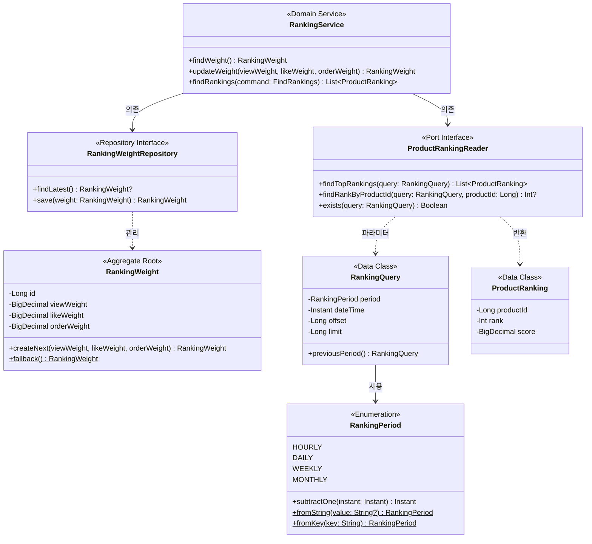

# 주간/월간 랭킹 도메인 모델링 문서

## 1. 클래스 다이어그램

### 주요 구조

**Aggregate: RankingWeight**

RankingWeight는 랭킹 가중치 설정을 관리하는 Aggregate Root이다. viewWeight, likeWeight, orderWeight 각각 0~1 범위의 불변식을 생성자에서 검증한다. 주간/월간 랭킹도 동일한 가중치 체계를 사용하므로 변경 없이 재사용한다.

**Enumeration: RankingPeriod (변경)**

기존 HOURLY, DAILY에 WEEKLY, MONTHLY를 추가한다. `subtractOne()` 메서드는 각 period에 맞게 이전 기간을 계산한다 (WEEKLY는 7일 전, MONTHLY는 30일 전).

**Data Class: RankingQuery**

조회 조건을 담는 데이터 클래스이다. `previousPeriod()` 메서드로 Fallback 조회를 지원한다. RankingPeriod에 WEEKLY, MONTHLY가 추가되면 자동으로 주간/월간 조회도 지원된다.

**Data Class: ProductRanking**

조회 결과를 표현하는 데이터 클래스이다. 변경 없이 주간/월간 조회 결과도 동일한 구조로 반환한다.

**Port Interface: ProductRankingReader**

랭킹 조회를 추상화하는 Port이다. 인터페이스 변경 없이 주간/월간용 구현체(RDB 조회)를 추가하면 된다.

**설계 의도:**

RankingPeriod enum 확장만으로 주간/월간을 지원할 수 있도록 설계되어 있다. 기존 인터페이스와 데이터 구조를 그대로 활용하고, 인프라 레이어에서 period별로 다른 저장소(Redis/RDB)를 선택하여 조회한다.

### Value Object/Data Class 불변식

| 객체 | 불변식 | 비고 |
|------|--------|------|
| RankingWeight.viewWeight | 0 ≤ value ≤ 1 | 생성자 검증 |
| RankingWeight.likeWeight | 0 ≤ value ≤ 1 | 생성자 검증 |
| RankingWeight.orderWeight | 0 ≤ value ≤ 1 | 생성자 검증 |
| RankingQuery.offset | offset ≥ 0 | 생성자 검증 |
| RankingQuery.limit | 1 ≤ limit ≤ 100 | 생성자 검증 |
| ProductRanking.rank | rank ≥ 1 | 비즈니스적으로 1부터 시작 |

### Repository/Port 인터페이스

도메인 관점에서 필요한 연산을 비즈니스 용어로 정의한다. 구현 상세(SQL, 캐시 명령어 등)는 detailed-design 참조.

**RankingWeightRepository**

| 메서드 | 비즈니스 의미 |
|--------|-------------|
| findLatest() | 현재 적용 중인 가중치 설정 조회 |
| save(weight) | 가중치 설정 저장 |

**ProductRankingReader**

| 메서드 | 비즈니스 의미 |
|--------|-------------|
| findTopRankings(query) | 조회 조건에 맞는 상위 랭킹 조회 |
| findRankByProductId(query, productId) | 특정 상품의 순위 조회 |
| exists(query) | 해당 조건의 랭킹 데이터 존재 여부 확인 |

---

## 2. 도메인 규칙

### 2.1 RankingPeriod 규칙

**subtractOne() 계산 규칙**

각 Period 타입별로 "이전 기간"을 계산하는 규칙이다. Fallback 조회 시 사용된다.

| Period | subtractOne() 결과 | 설명 |
|--------|-------------------|------|
| HOURLY | 1시간 전 | 기존 |
| DAILY | 1일 전 | 기존 |
| WEEKLY | 7일 전 | 신규 |
| MONTHLY | 30일 전 | 신규 |

### 2.2 가중치 규칙

**RankingWeight 불변식**

viewWeight, likeWeight, orderWeight는 모두 0 이상 1 이하여야 한다. 범위를 벗어나는 값으로 생성/수정 시 예외가 발생한다.

**인기도 계산 공식**

| 공식 |
|------|
| viewCount × viewWeight + likeCount × likeWeight + orderAmount × orderWeight |

주간/월간 랭킹도 동일한 공식을 사용하며, 해당 기간의 일간 메트릭을 합산한 후 가중치를 적용한다.

**계산 예시**

| viewCount | likeCount | orderAmount | viewWeight | likeWeight | orderWeight | Score |
|-----------|-----------|-------------|------------|------------|-------------|-------|
| 1000 | 50 | 100000 | 0.10 | 0.20 | 0.60 | 60110.0 |

### 2.3 조회 규칙

**RankingQuery 불변식**

offset은 0 이상이어야 하고, limit은 1 이상 100 이하여야 한다. 범위를 벗어나면 예외가 발생한다.

**Fallback 정책**

offset이 0이고 현재 버킷이 비어있으면 이전 period 버킷을 한 번 조회한다. 이 규칙은 주간/월간에도 동일하게 적용된다.

---

## 3. 상태 다이어그램

해당 없음.

**이유:**

Rankings 도메인은 "집계와 조회" 중심으로 상태 머신이 필요한 엔티티가 없다. RankingWeight는 상태 전이 없이 값 변경만 존재하고, ProductRanking과 RankingQuery는 상태를 가지지 않는 Data Class이다.

---

## 4. 도메인 이벤트

해당 없음.

**이유:**

주간/월간 랭킹 추가는 기존 도메인 구조의 확장이며, 새로운 도메인 이벤트가 필요하지 않다. 배치 처리는 인프라 레이어에서 스케줄링되고, 조회는 기존 Port 인터페이스를 통해 동기적으로 처리된다.
