# 솔루션 설계 문서: 주간/월간 랭킹 시스템

## 1. 설계 컨텍스트

### 1.1 핵심 해결 과제

현재 시스템은 실시간(시간대별) 랭킹과 일간 랭킹만 제공하고 있어, 순간적인 트렌드는 파악할 수 있지만 꾸준히 인기 있는 상품을 파악하기 어렵다. 구매자가 거시적인 트렌드를 확인하고 검증된 인기 상품을 탐색할 수 있도록 주간(최근 7일) 및 월간(최근 30일) 랭킹을 제공하고자 한다.

추가로, 기존 commerce-streamer에 분산되어 있던 스케줄러 기반 집계 로직을 commerce-batch 모듈의 Spring Batch Job으로 통합하여 일관된 배치 관리 체계를 구축한다.

### 1.2 현재 아키텍처 영향

현재 시스템은 Kotlin + Spring Boot 멀티모듈 모놀리식 프로젝트로 구성되어 있다. commerce-api는 랭킹 조회 API를 제공하고, commerce-streamer는 Kafka Consumer로 이벤트를 수신하여 메트릭을 적재하며 스케줄러로 랭킹을 집계한다. commerce-batch 모듈이 이미 존재하며 Spring Batch 인프라(Job/Step/Listener)가 구축되어 있다.

랭킹에 필요한 데이터 구조가 이미 존재한다. ProductHourlyMetric은 시간별 상품 행동 메트릭을, ProductDailyMetric은 일별 상품 행동 메트릭을, RankingWeight는 가중치 설정(view: 0.10, like: 0.20, order: 0.60)을 저장한다. RankingPeriod enum에는 현재 HOURLY와 DAILY만 존재하며, WEEKLY와 MONTHLY 추가가 필요하다.

### 1.3 기술 스택 개요

개발 언어는 Kotlin이며 Spring Boot 프레임워크를 사용한다. 배치 처리는 Spring Batch를 활용한다. 데이터베이스는 PostgreSQL이고, commerce-batch에서는 JdbcTemplate, commerce-api에서는 Spring Data JPA를 사용한다. 캐시는 Redis를 사용하며, 메시지 큐는 Kafka를 사용한다.

## 2. 솔루션 대안 분석

### 대안 1: commerce-batch에서 Spring Batch 집계 + RDB 히스토리 + Redis 캐시

**설명:** commerce-batch 모듈에서 Spring Batch Job을 구현하여 매일 일간 메트릭을 집계하고, 주간/월간 랭킹 스냅샷을 RDB에 저장한다. 조회 시 Cache-Aside 패턴으로 Redis 캐싱을 적용한다.

**문제 해결 방식:** 배치 Job이 매일 실행되어 ProductDailyMetric 테이블에서 최근 7일/30일 데이터를 조회하고, 가중치를 적용하여 스코어를 계산한 뒤 TOP 100 상품을 ProductPeriodRanking 테이블에 저장한다. Spring Batch의 Chunk 기반 처리와 JobRepository를 활용하여 재시작 가능성을 확보한다.

**장점:**

- Spring Batch가 제공하는 재시작 가능성(Restartability)이 "재시작 후 이어서 처리" 요구사항을 자연스럽게 충족
- 기존 commerce-batch 모듈을 활용하므로 새로운 인프라 도입 불필요
- RDB에 날짜별 스냅샷을 저장하므로 과거 시점 랭킹 조회 용이
- JobRepository 기반 중복 실행 방지 기본 제공
- JobExecution 메타데이터를 통한 배치 모니터링 기본 제공

**단점:**

- 새로운 테이블(ProductPeriodRanking) 추가 필요
- 매일 전체 재계산 방식이므로 데이터가 많아지면 처리 시간 증가 가능 (다만 TOP 100만 저장하므로 실질적 부담은 적음)

**아키텍처 영향:** commerce-batch에 HourlyRankingJob, DailyRankingJob, WeeklyRankingJob, MonthlyRankingJob 추가. commerce-streamer의 스케줄러 로직 제거. commerce-api의 RankingPeriod에 WEEKLY, MONTHLY 추가.

### 대안 2: commerce-streamer 스케줄러 확장

**설명:** 기존 DailyMetricRollupScheduler와 유사하게 commerce-streamer에 주간/월간 집계 스케줄러를 추가한다. 매일 정해진 시간에 스케줄러가 실행되어 집계를 수행한다.

**문제 해결 방식:** @Scheduled 어노테이션 기반 스케줄러가 매일 실행되어 일간 메트릭을 조회하고 집계한다. 결과를 RDB에 저장하고 Redis에 캐싱한다.

**장점:**

- 기존 스케줄러 패턴과 일관성 유지
- commerce-streamer에 이미 랭킹 관련 로직이 있어 도메인 응집도 높음

**단점:**

- Spring Scheduler는 재시작 가능성을 기본 제공하지 않아 "재시작 후 이어서 처리" 요구사항 미충족
- 멀티 인스턴스 환경에서 중복 실행 방지를 위한 분산 락 구현 필요
- 배치 모니터링 인프라 직접 구축 필요

**아키텍처 영향:** commerce-streamer에 스케줄러 및 집계 로직 추가. 분산 락을 위한 ShedLock 같은 라이브러리 도입 필요.

### 대안 3: commerce-api에서 조회 시점 집계 (On-demand 계산)

**설명:** 별도 배치 없이 사용자가 주간/월간 랭킹을 조회할 때 ProductDailyMetric 테이블에서 최근 7일/30일 데이터를 실시간으로 집계하여 반환한다.

**문제 해결 방식:** RankingService가 조회 요청을 받으면 SQL 집계 쿼리로 일간 메트릭을 합산하고 스코어를 계산한다. 결과를 Redis에 짧은 TTL로 캐싱하여 반복 조회 시 성능을 확보한다.

**장점:**

- 가장 단순한 구현
- 별도 배치나 스토리지 불필요
- 항상 최신 데이터 반영

**단점:**

- 매 조회 시 7~30일 데이터를 집계하므로 성능 문제 발생 가능
- 과거 시점 랭킹 조회 불가 (스냅샷 없음)
- 배치 수동 실행/재집계 요구사항 충족 불가
- "재시작 후 이어서 처리" 요구사항 해당 없음

**아키텍처 영향:** commerce-api의 RankingService에 집계 로직 추가만 필요하나, 요구사항의 상당 부분을 충족하지 못함.

## 3. 선택된 솔루션

### 3.1 결정 요약

**대안 1: commerce-batch에서 Spring Batch 집계 + RDB 히스토리 + Cache-Aside 패턴**을 선택한다. 추가로 commerce-streamer의 기존 스케줄러 로직(RankingScoreScheduler, DailyMetricRollupScheduler)을 모두 commerce-batch의 Spring Batch Job으로 이관한다.

**선택 이유:**

첫째, 팀의 "ROI 중심" 가치에 부합한다. 기존 commerce-batch 모듈과 Spring Batch 인프라를 그대로 활용하여 새로운 인프라 도입 없이 구현 가능하다.

둘째, 요구사항을 완벽히 충족한다. Spring Batch의 재시작 가능성이 "배치 실행 중 시스템 종료 시 재시작 후 이어서 처리" 요구사항을 자연스럽게 해결한다. JobRepository 기반 중복 실행 방지로 멀티 인스턴스 환경에서도 안전하다. JobExecution 메타데이터로 배치 모니터링 요구사항도 충족한다.

셋째, 역할 분리가 명확해진다. commerce-streamer는 이벤트 수신 및 메트릭 적재만 담당하고, commerce-batch는 모든 배치 처리를 담당하여 책임이 명확히 분리된다.

### 3.2 솔루션 구조

#### 핵심 아키텍처 컴포넌트

**1. commerce-batch (배치 처리 시스템)**

모든 랭킹 관련 배치 Job을 담당한다. HourlyRankingJob은 30분마다 실행되어 시간별 랭킹을 계산하고 Redis에 저장한다. TodayDailyRollupJob은 6시간마다(01:00, 07:00, 13:00, 19:00) 실행되어 시간별 메트릭을 일간으로 롤업한다. YesterdayReconciliationJob은 매일 04:00에 실행되어 전일 데이터를 정합성 검증 및 보정한다. DailyRankingJob은 12시간마다(01:00, 13:00) 실행되어 일간 랭킹을 Redis에 저장한다. WeeklyRankingJob과 MonthlyRankingJob은 하루에 한 번(02:00) 실행되어 일간 메트릭을 집계하고 RDB에 저장한다. 관리자용 REST API를 제공하여 주간/월간 배치 수동 실행 및 재집계를 지원한다(시간별/일간 랭킹은 Redis 전용이므로 수동 실행 대상 아님).

**2. commerce-streamer (이벤트 처리 시스템)**

Kafka Consumer로서 도메인 이벤트 수신 및 메트릭 적재만 담당한다. ProductViewedEvent, LikeCreatedEvent, LikeCanceledEvent, OrderPaidEvent를 수신하여 ProductHourlyMetric에 저장한다. 기존 스케줄러 로직은 모두 commerce-batch로 이관되어 제거된다.

**3. commerce-api (API 시스템)**

구매자용 랭킹 조회 API를 제공한다. 실시간/일간/주간/월간 랭킹 조회 및 과거 시점 랭킹 조회를 지원한다. 주간/월간 랭킹 조회 시 Cache-Aside 패턴을 적용한다. RankingPeriod enum에 WEEKLY, MONTHLY를 추가한다.

**4. 데이터 저장소**

RDB에는 ProductHourlyMetric(시간별 메트릭), ProductDailyMetric(일간 메트릭), ProductPeriodRanking(주간/월간 랭킹 스냅샷, 신규), RankingWeight(가중치 설정)를 저장한다. Redis에는 실시간 랭킹(TTL 2시간), 일간 랭킹(TTL 2일), 주간/월간 랭킹 캐시를 저장한다.

#### 데이터 흐름

**1. 주간/월간 랭킹 배치 흐름**

**2. 실시간/일간 랭킹 배치 흐름**

**3. 주간/월간 랭킹 조회 흐름 (Cache-Aside)**

```mermaid
sequenceDiagram
    participant C as Client
    participant API as RankingFacade
    participant CACHE as Redis
    participant PS as ProductService
    participant DB as RDB

    C->>API: 랭킹 조회 (periodType, baseDate, page, size)
    activate API

    API->>CACHE: 캐시 조회 [Redis Client]

    alt 캐시 히트
        CACHE-->>API: 랭킹 데이터
    else 캐시 미스
        CACHE-->>API: null

        API->>PS: 랭킹 조회 요청 [함수 호출]
        activate PS
        
        PS->>DB: ProductPeriodRanking 조회 [JPA]
        activate DB
        alt 당일 데이터 존재
            DB-->>PS: 랭킹 데이터
        else Fallback (전일 조회)
            DB-->>PS: 전일 데이터 또는 빈 목록
        end
        deactivate DB
        
        PS-->>API: 랭킹 + 상품 정보
        deactivate PS

        API->>CACHE: 캐시 저장 [Redis Client]
    end

    API-->>C: 랭킹 응답
    deactivate API
```

**4. 배치 수동 실행 흐름 (US-3)**

### 3.3 시스템 간 통합

| 통합 지점 | 통신 패턴 | 동기/비동기 | 실패 처리 | 근거 |
|----------|----------|------------|----------|------|
| commerce-batch → RDB (메트릭 조회) | 함수 호출 (JDBC) | 동기 | 재시도 후 Job 실패 처리 | 같은 프로세스, source of truth |
| commerce-batch → RDB (랭킹 저장) | 함수 호출 (JDBC) | 동기 | Chunk 단위 롤백, 재시작 시 이어서 처리 | Spring Batch 기본 동작 |
| commerce-batch → Redis (실시간/일간) | Redis Client | 동기 | 실패 시 로그 후 Job 실패 처리 | 실시간/일간은 Redis가 유일한 저장소 |
| commerce-api → Redis (캐시 조회) | Redis Client | 동기 | 캐시 미스 시 RDB fallback | Cache-Aside 패턴 |
| commerce-api → RDB (랭킹 조회) | 함수 호출 (JPA) | 동기 | 실패 시 에러 응답 | source of truth, 캐시 미스 시 사용 |
| RankingFacade → ProductService | 함수 호출 (in-process) | 동기 | 실패 시 에러 응답 | 같은 모듈 내 도메인 |

### 3.4 데이터 일관성 정책

| 저장소 관계 | Source of Truth | 일관성 정책 | 근거 |
|------------|-----------------|------------|------|
| RDB (주간/월간) ↔ Redis | RDB | 조회 시 캐시 미스면 RDB 조회 후 캐싱 | Cache-Aside 패턴, 배치는 RDB만 책임 |
| Redis (실시간/일간) | Redis | 배치가 직접 Redis에 저장, TTL로 만료 관리 | 과거 조회 불필요, 휘발성 허용 |

### 3.5 트랜잭션 경계

| 작업 | 트랜잭션 범위 | 패턴 | 비고 |
|------|-------------|------|------|
| 주간/월간 랭킹 저장 | Chunk 단위 DB 트랜잭션 | Spring Batch Chunk | 실패 시 해당 Chunk만 롤백, 재시작 시 이어서 처리 |
| 실시간/일간 랭킹 저장 | Redis 명령 단위 | 단일 Redis 명령 | 실패 시 다음 배치에서 덮어쓰기 |
| 랭킹 조회 + 캐시 저장 | 별도 트랜잭션 없음 | Cache-Aside | 캐시 저장 실패해도 조회 결과 반환 |
